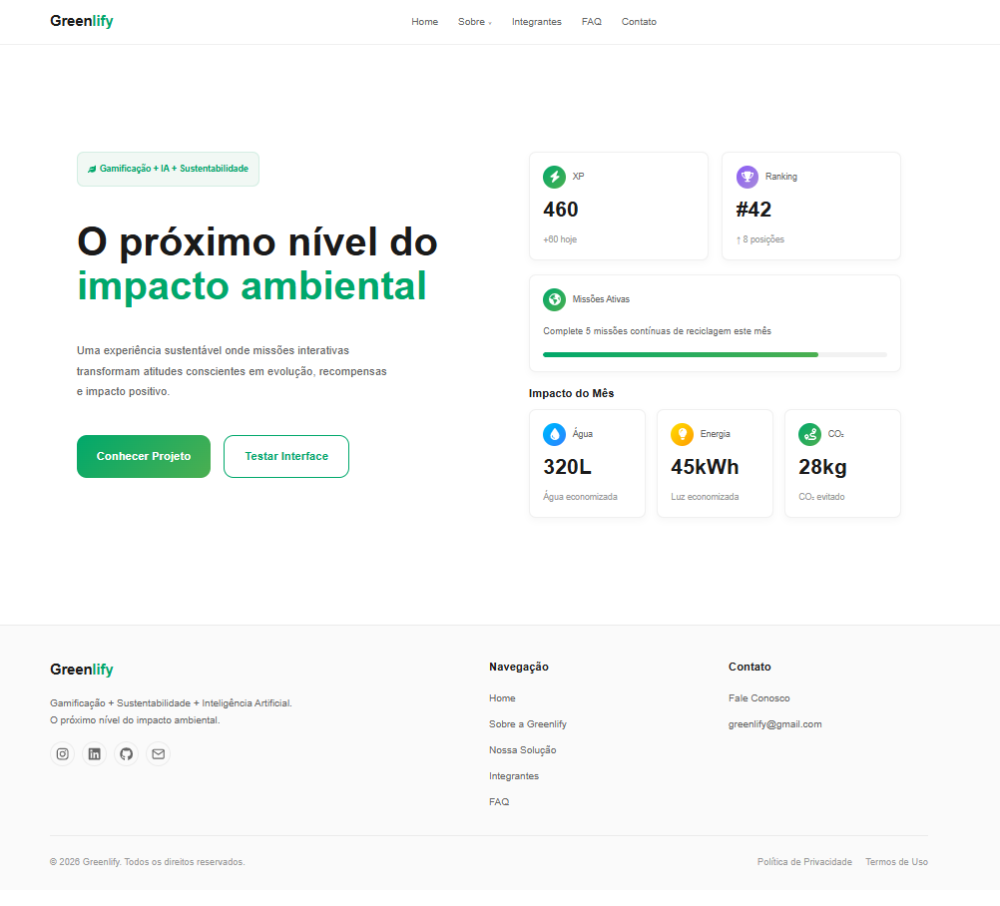
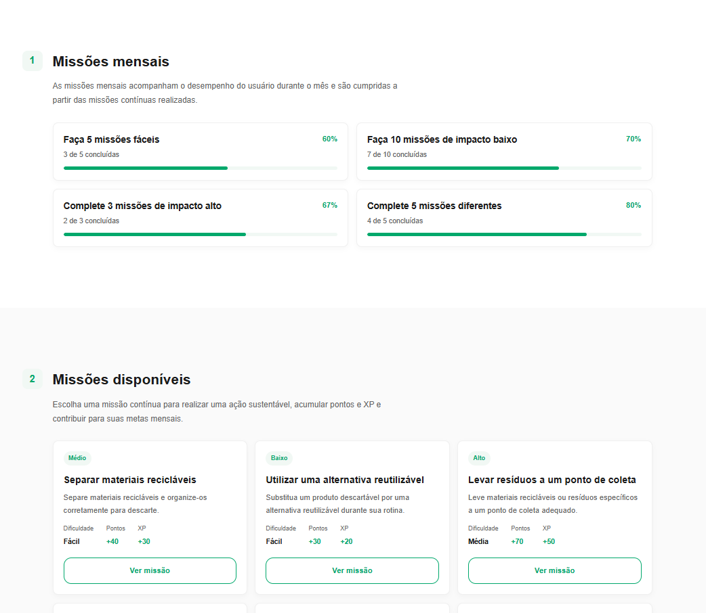
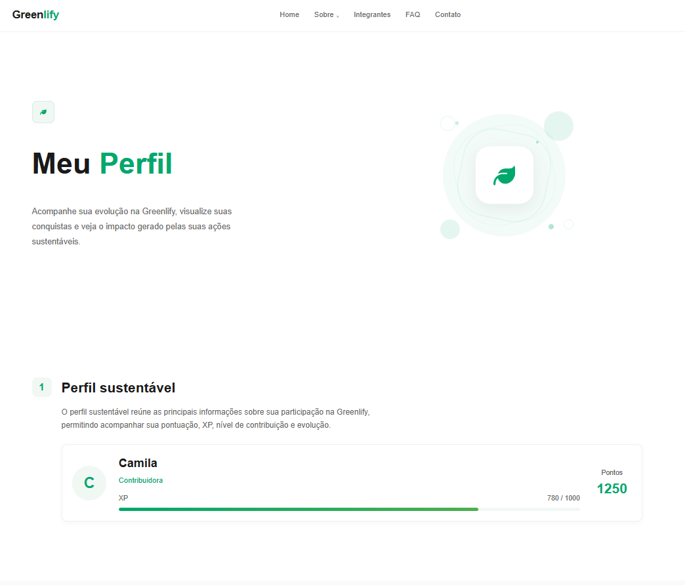

# 🌱 Greenlify

<p align="center">
  <strong>Gamificação para incentivar hábitos sustentáveis</strong>
</p>

<p align="center">
  Projeto desenvolvido para a FIAP em parceria com a SoulUp.
</p>

---

## 📌 Descrição do Projeto

A **Greenlify** é um módulo de gamificação sustentável desenvolvido para a plataforma **SoulUp**.

A solução busca incentivar hábitos sustentáveis por meio de **missões, pontuação, rankings e recompensas**, transformando ações sustentáveis em uma experiência mais interativa e motivadora.

O usuário pode realizar missões, enviar comprovações das atividades, acumular pontos, acompanhar seu progresso, participar de rankings e conquistar recompensas dentro da plataforma.

---

## 🛠️ Tecnologias Utilizadas

<div align="center">


<br>


</div>

### Principais tecnologias

| Tecnologia | Utilização |
|---|---|
| **React** | Desenvolvimento da interface e criação de componentes reutilizáveis. |
| **TypeScript** | Tipagem dos componentes, propriedades, dados e funcionalidades. |
| **Vite** | Configuração do projeto, desenvolvimento e build da aplicação. |
| **Tailwind CSS** | Estilização da interface e desenvolvimento responsivo. |
| **React Router DOM** | Navegação entre as páginas e criação de rotas dinâmicas. |
| **React Hook Form** | Gerenciamento e validação dos formulários. |
| **Git** | Controle de versão do projeto. |
| **GitHub** | Hospedagem do repositório e colaboração da equipe. |

---


## ✨ Funcionalidades

A Greenlify foi estruturada para apresentar uma experiência completa de participação, desde a exploração das missões até o acompanhamento dos resultados obtidos pelo usuário.

<table>
  <tr>
    <td align="center">🌱</td>
    <td>
      <strong>Missões Sustentáveis</strong><br>
      Exibição de missões contínuas e mensais com descrição, critérios, prazo, dificuldade e impacto ambiental.
    </td>
  </tr>

  <tr>
    <td align="center">🔎</td>
    <td>
      <strong>Detalhamento das Missões</strong><br>
      Visualização das informações específicas de cada missão antes de sua realização.
    </td>
  </tr>

  <tr>
    <td align="center">🎥</td>
    <td>
      <strong>Envio de Comprovação</strong><br>
      Simulação do envio de vídeos utilizados como comprovação da realização das atividades.
    </td>
  </tr>

  <tr>
    <td align="center">🤖</td>
    <td>
      <strong>Validação Inteligente</strong><br>
      Processo de validação das comprovações utilizando inteligência artificial para verificar a realização das ações.
    </td>
  </tr>

  <tr>
    <td align="center">🔐</td>
    <td>
      <strong>Segurança e Prevenção de Fraudes</strong><br>
      Utilização de mecanismos como validação de arquivos, controle de tentativas e fingerprint para reduzir comportamentos fraudulentos.
    </td>
  </tr>

  <tr>
    <td align="center">🏆</td>
    <td>
      <strong>Pontuação</strong><br>
      Acúmulo de pontos de acordo com o impacto ambiental das missões realizadas e seus resultados de validação.
    </td>
  </tr>

  <tr>
    <td align="center">⭐</td>
    <td>
      <strong>XP e Nível de Contribuição</strong><br>
      Acompanhamento da experiência acumulada e da evolução do usuário dentro da plataforma.
    </td>
  </tr>

  <tr>
    <td align="center">🏅</td>
    <td>
      <strong>Rankings</strong><br>
      Consulta aos rankings <strong>mensal</strong>, <strong>all time</strong> e de <strong>grupos</strong>, permitindo acompanhar diferentes formas de desempenho.
    </td>
  </tr>

  <tr>
    <td align="center">👥</td>
    <td>
      <strong>Grupos</strong><br>
      Criação, entrada e visualização de grupos para participação e comparação do desempenho coletivo.
    </td>
  </tr>

  <tr>
    <td align="center">💰</td>
    <td>
      <strong>Recompensas</strong><br>
      Disponibilização de recompensas relacionadas ao desempenho do usuário e aos resultados obtidos nas atividades.
    </td>
  </tr>

  <tr>
    <td align="center">🔥</td>
    <td>
      <strong>Streak</strong><br>
      Acompanhamento da participação contínua do usuário nas atividades da Greenlify.
    </td>
  </tr>

  <tr>
    <td align="center">👤</td>
    <td>
      <strong>Perfil Sustentável</strong><br>
      Visualização de pontos, XP, missões concluídas, nível de contribuição, impacto ambiental e evolução do usuário.
    </td>
  </tr>

  <tr>
    <td align="center">📊</td>
    <td>
      <strong>Desempenho Mensal</strong><br>
      Resumo dos resultados obtidos durante o mês, incluindo pontos, missões concluídas e posição no ranking.
    </td>
  </tr>

  <tr>
    <td align="center">📤</td>
    <td>
      <strong>Compartilhamento</strong><br>
      Possibilidade de compartilhar o resumo do desempenho mensal e das conquistas obtidas.
    </td>
  </tr>
</table>

---

## 📁 Estrutura de Pastas do Projeto

A estrutura do projeto foi organizada de forma a separar as páginas, componentes reutilizáveis, imagens e arquivos de configuração da aplicação.

```text
greenlify-front/
│
├── src/
│   ├── docs/
│   │   └── img/
│   │     ├── home.png
│   │     ├── missoes.png
│   │     └── perfil.png
│   │
│   ├── assets/
│   │   └── img/
│   │     ├── sobre/
│   │     └── integrantes/
│   │ 
│   ├── components/
│   │   ├── Button/
│   │   ├── Card/
│   │   ├── Dashboard/
│   │   ├── FAQCard/
│   │   ├── Footer/
│   │   ├── Forms/
│   │   ├── Header/
│   │   ├── Hero/
│   │   ├── Menu/
│   │   ├── MissionCard/
│   │   ├── MissionFilter/
│   │   ├── MissionModal/
│   │   ├── ProfileHeader/
│   │   ├── ProfileStat/
│   │   ├── RankingTable/
│   │   ├── RankingTabs/
│   │   ├── Roadmap/
│   │   └── Section/
│   │
│   ├── routes/
│   │   ├── Home/
│   │   ├── Sobre/
│   │   ├── NossaSolucao/
│   │   ├── Missoes/
│   │   ├── MissaoDetalhe/
│   │   ├── Perfil/
│   │   ├── Integrantes/
│   │   ├── Contato/
│   │   ├── FAQ/
│   │   └── Error/
│   │
│   ├── App.tsx
│   ├── main.tsx
│   └── global.css
│
├── .gitignore
├── package.json
├── package-lock.json
├── tsconfig.app.json
├── tsconfig.json
├── vite.config.ts
└── README.md
```
---

## 🖼️ Imagens do Projeto

A interface do Greenlify foi desenvolvida com uma identidade visual voltada à sustentabilidade, utilizando imagens, ícones e elementos gráficos para tornar a navegação mais intuitiva e apresentar as principais funcionalidades da solução.

### 💻 Interfaces do Projeto

<p align="center">
  
</p>

<p align="center">
  
</p>

<p align="center">
  
</p>

---

## 🚀 Como Usar

### 📋 Pré-requisitos

Para executar o projeto localmente, é necessário ter instalado:

- Node.js
- npm
- Git

### 📥 Instalação

Clone o repositório:

```bash
git clone https://github.com/milasnt/greenlify-front.git
```
Acesse a pasta do projeto:

```bash
cd greenlify-front
```

Instale as dependências:
```bash
npm install
```

Após instalar as dependências, execute o servidor de desenvolvimento:
```bash
npm run dev
```

O Vite disponibilizará um endereço local no terminal. Acesse o endereço pelo navegador, normalmente:

```bash
http://localhost:5173
```

---

## 👨‍💻 Autores e Créditos

<table>
  <tr>
    <th>Integrante</th>
    <th>RM</th>
    <th>Turma</th>
    <th>LinkedIn</th>
    <th>GitHub</th>
  </tr>

  <tr>
    <td>Camila Souza Santana</td>
    <td>RM573993</td>
    <td>1TDSPJ</td>
    <td>
      <a href="https://www.linkedin.com/in/camila-souza-52164a3a5/">
        LinkedIn
      </a>
    </td>
    <td>
      <a href="https://github.com/milasnt">
        GitHub
      </a>
    </td>
  </tr>

  <tr>
    <td>Enzo Gabriel Florencio Pereira</td>
    <td>RM573898</td>
    <td>1TDSPK</td>
    <td>
      <a href="https://www.linkedin.com/in/enzo-pereira-931a323a6/">
        LinkedIn
      </a>
    </td>
    <td>
      <a href="https://github.com/EnzoPereira0618">
        GitHub
      </a>
    </td>
  </tr>

  <tr>
    <td>Lucas Marti Zapater Vieira</td>
    <td>RM571053</td>
    <td>1TDSPJ</td>
    <td>
      <a href="https://www.linkedin.com/in/lucas-marti-zapater-vieira-b902a4236/">
        LinkedIn
      </a>
    </td>
    <td>
      <a href="https://github.com/Lucasvieira-tech">
        GitHub
      </a>
    </td>
  </tr>

  <tr>
    <td>Sophia Teixeira Ramada</td>
    <td>RM573823</td>
    <td>1TDSPJ</td>
    <td>
      <a href="https://www.linkedin.com/in/sophia-ramada-228b07364/">
        LinkedIn
      </a>
    </td>
    <td>
      <a href="https://github.com/sophRmd">
        GitHub
      </a>
    </td>
  </tr>
</table>

---

## 🔗 Links

### 📁 Repositório do GitHub

<p>
  <a href="https://github.com/milasnt/greenlify-front">
    🔗<strong>Acessar o repositório do projeto</strong>
  </a>
</p>

---

---

## 📞 Contato

Para dúvidas, sugestões ou informações sobre o projeto, entre em contato com os integrantes da equipe através dos links disponibilizados na seção **Autores e Créditos**.

Também é possível entrar em contato diretamente pelo e-mail:

<p align="center">
  📧 <strong>greenlify@gmail.com</strong>
</p>

---

<div align="center">

### 🌱 Greenlify

<strong>Tecnologia + Gamificação + Sustentabilidade</strong>

Desenvolvido com 💚 para a <strong>FIAP</strong>.

</div>